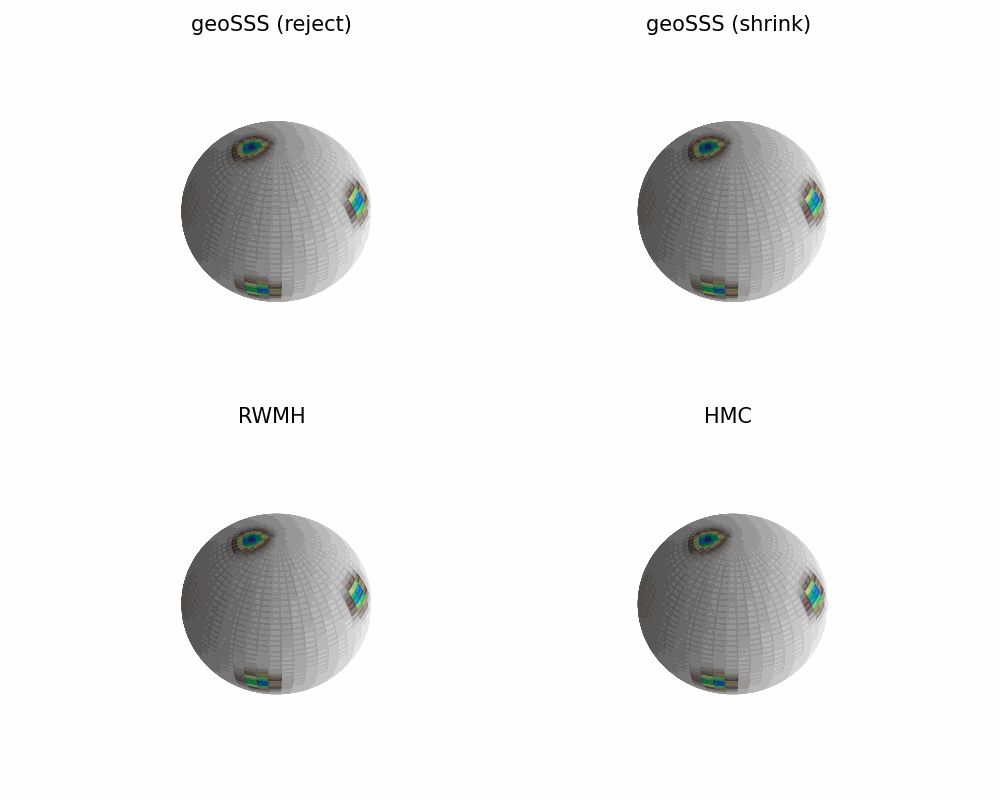

<h1 align="center">

</h1><br>

[](
https://doi.org/10.48550/arXiv.2301.08056)

# GeoSSS: Geodesic Slice Sampling on the Sphere

This Python package implements two new tuning-free MCMC algorithms, an **ideal geodesic slice sampler** based on accept/reject strategy and a **shrinkage-based geodesic slice** sampler to sample from spherical distributions on arbitrary dimensions. The package also includes the implementation of random-walk Metropolis-Hastings (RWMH) and Hamiltonian Monte Carlo (HMC) whose step-size parameter is automaticall tuned.
As shown in our [paper](https://doi.org/10.48550/arXiv.2301.08056), our algorithms have outperformed RWMH and HMC for spherical distributions. 

This demo quickly illustrates that. By comparing our samplers GeoSSS (reject) and GeoSSS (shrink) (top row) vs RWMH and HMC (bottom row) for a target that is a mixture of von Mises-Fisher distribution on a 2-sphere with concentration parameter $\kappa=80$ and by using $10^3$ samples. Our samplers explore all modes, while RWMH and HMC gets stuck in a single mode. 



## Installation

GeoSSS is available for installation from PyPI (TODO: Add a link here later). Therefore, simply type:
```
# TODO: not yet on PyPI
pip install geosss
```

## Getting Started

A minimal example to get started as well as reproduce the above demo:

```python
import geosss as gs
import numpy as np

# parameters for mixture of von Mises-Fisher (vMF)
# distributions
d = 3                          # required dimension
K = 3                          # number of mixture components
kappa = 80.0                   # concentration parameter

# mus (mean directions) of the vMF mixture components
mus = np.array([[0.86981638, -0.37077248, 0.32549536],
                [-0.19772391, -0.89279985, -0.40473902],
                [0.19047726, 0.22240888, -0.95616562]])

# target pdf
vmfs = [gs.VonMisesFisher(kappa*mu) for mu in mus]
pdf = gs.MixtureModel(vmfs)

# sampler parameters
n_samples = int(1e3)           # no. of samples
burnin = int(0.1 * n_samples)  # burnin samples
seed = 3521                    # sampler seed

# initial state of the samplers
init_state = np.array([-0.86333052,  0.18685286, -0.46877117])

# sampling with the four samplers 

# GeoSSS (reject): ideal geodesic slice sampler
rsss = gs.RejectionSphericalSliceSampler(pdf, init_state, seed)
rsss_samples = rsss.sample(n_samples, burnin)

# GeoSSS (shrink): shrinkage-based geodesic slice sampler
ssss = gs.ShrinkageSphericalSliceSampler(pdf, init_state, seed)
ssss_samples = ssss.sample(n_samples, burnin)

# RWMH: random-walk Metropolis Hastings
rwmh = gs.MetropolisHastings(pdf, init_state, seed)
rwmh_samples = rwmh.sample(n_samples, burnin)

# HMC: Hamiltonian Monte Carlo
hmc = gs.SphericalHMC(pdf, init_state, seed)
hmc_samples = hmc.sample(n_samples, burnin)

# save all the samples in a dictionary
samples = {
    'sss-reject': rsss_samples,
    'sss-shrink': ssss_samples,
    'rwmh': rwmh_samples,
    'hmc': hmc_samples
}

# visualize samples in 3d
gs.compare_samplers_3d(pdf, samples)
```

The plots in the [paper](https://doi.org/10.48550/arXiv.2301.08056) under numerical illustrations section were generated using [`bingham.py`](scripts/bingham.py), [`mixture_vMF.py`](scripts/mixture_vMF.py), [`ess_vMF.py`](scripts/ess_vMF.py) and [`curve.py`](scripts/curve.py).

## Development

The package is maintained by [Poetry](https://python-poetry.org/). To install this package and its dependencies in a dedicated virtual environment, please do the following

```
git clone https://github.com/ShantanuKodgirwar/geosss
cd geosss
poetry install
```

## Citation

If you use this package, or ideas from the paper, please consider citing us.
```
@misc{habeck2023,
      title={Geodesic slice sampling on the sphere}, 
      author={Michael Habeck and Mareike Hasenpflug and Shantanu Kodgirwar and Daniel Rudolf},
      year={2023},
      eprint={2301.08056},
      archivePrefix={arXiv},
      primaryClass={stat.ME}
}
```

