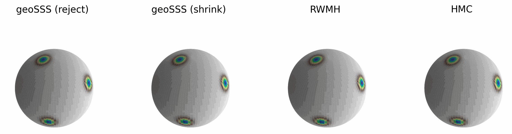

<p align="center">

</p>

<div align="center">

  [](https://pypi.org/project/geosss/)
  
  [](
  https://doi.org/10.48550/arXiv.2301.08056)
  [](https://opensource.org/licenses/BSD-3-Clause)

</div>

# GeoSSS: Geodesic Slice Sampling on the Sphere

This python package implements two novel tuning-free MCMC algorithms, an **ideal geodesic slice sampler** based on accept/reject strategy and a **shrinkage-based geodesic slice sampler** to sample from spherical distributions on arbitrary dimensions. The package also includes the implementation of random-walk Metropolis-Hastings (RWMH) and Hamiltonian Monte Carlo (HMC) whose step-size parameter is automatically tuned.
As shown in our [paper](https://doi.org/10.48550/arXiv.2301.08056), our algorithms have outperformed RWMH and HMC for spherical distributions. To reproduce the results in the paper, see this [section](#development-and-reproducibility). However, to get started, please install the package and follow along with the demo to illustrate the use of the algorithm as given below. 


## Installation

GeoSSS is available for installation from [PyPI](https://pypi.org/project/geosss/). Therefore, simply type:

```bash
pip install geosss
```

## Minimal Example

We consider a target that is a mixture of von Mises-Fisher distribution on a 2-sphere with concentration parameter $\kappa=80$. By using $10^3$ samples, our samplers geoSSS (reject) and geoSSS (shrink) (top row) explore all modes, whereas RWMH and HMC (bottom row) get stuck in a single mode. 

<p align="center">

</p>

This demo can be created with the below script.

[](https://colab.research.google.com/github/microscopic-image-analysis/geosss/blob/main/scripts/demo.ipynb)
```python
import geosss as gs
import numpy as np

# parameters for mixture of von Mises-Fisher (vMF)
# distributions
d = 3                          # required dimension
K = 3                          # number of mixture components
kappa = 80.0                   # concentration parameter

# mus (mean directions) of the vMF mixture components
mus = np.array([[0.86981638, -0.37077248, 0.32549536],
                [-0.19772391, -0.89279985, -0.40473902],
                [0.19047726, 0.22240888, -0.95616562]])

# target pdf
vmfs = [gs.VonMisesFisher(kappa*mu) for mu in mus]
pdf = gs.MixtureModel(vmfs)

# sampler parameters
n_samples = int(1e3)           # no. of samples
burnin = int(0.1 * n_samples)  # burnin samples
seed = 3521                    # sampler seed

# initial state of the samplers
init_state = np.array([-0.86333052,  0.18685286, -0.46877117])

# sampling with the four samplers
samples = {}

# geoSSS (reject): ideal geodesic slice sampler
rsss = gs.RejectionSphericalSliceSampler(pdf, init_state, seed)
samples['sss-reject'] = rsss.sample(n_samples, burnin)

# geoSSS (shrink): shrinkage-based geodesic slice sampler
ssss = gs.ShrinkageSphericalSliceSampler(pdf, init_state, seed)
samples['sss-shrink'] = ssss.sample(n_samples, burnin)

# RWMH: random-walk Metropolis Hastings
rwmh = gs.MetropolisHastings(pdf, init_state, seed)
samples['rwmh'] = rwmh.sample(n_samples, burnin)

# HMC: Hamiltonian Monte Carlo
hmc = gs.SphericalHMC(pdf, init_state, seed)
samples['hmc'] = hmc.sample(n_samples, burnin)

# visualize samples in 3d
gs.compare_samplers_3d(pdf, samples)
```

## Development and Reproducibility

It is preferable to install the package in the development mode for modifications. Additionally, this will also ensure reproducibility of the results from the numerical illustrations section of the [paper](https://doi.org/10.48550/arXiv.2301.08056).

Clone the repository and navigate to the root of the folder,

```bash
git clone https://github.com/microscopic-image-analysis/geosss.git
cd geosss
```

You can now create a virtual environment (with `conda` for example),

```bash
conda create --name geosss-venv python=3.11 # or python >= 3.10, < 3.13
conda activate geosss-venv
```

The dependencies can be installed in this environment with `pip` as,
```bash
pip install -r requirements.txt
```

Alternatively, because the `pyproject.toml` file is based on the python package manager [Poetry](https://python-poetry.org/docs/#installing-with-the-official-installer), it is possible to install with `poetry` in the activated `conda` environment.

```bash
poetry install --all-extras --sync
```

For reproducing the results in the paper, please check the [scripts](scripts/) directory. Precomputed results can also be downloaded from [Zenodo](https://doi.org/10.5281/zenodo.8287302) and plotted with these scripts.

## Citation

If you use this package or ideas from the paper, please consider citing us.
```bash
@misc{habeck2023,
      title={Geodesic slice sampling on the sphere}, 
      author={Michael Habeck and Mareike Hasenpflug and Shantanu Kodgirwar and Daniel Rudolf},
      year={2023},
      eprint={2301.08056},
      archivePrefix={arXiv},
      primaryClass={stat.ME}
}
```

